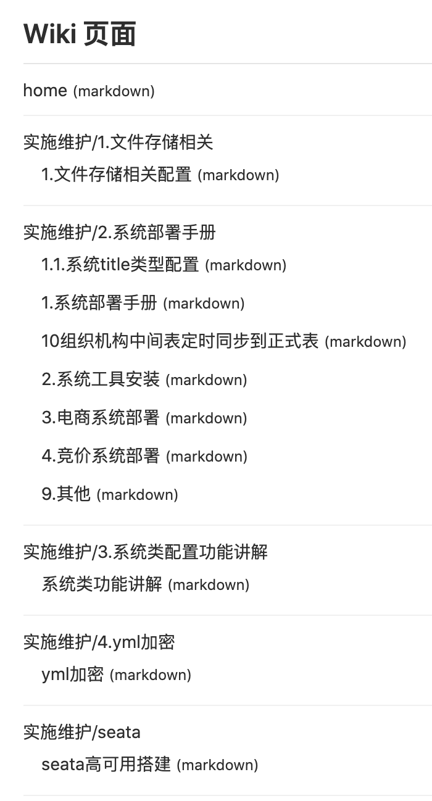

# 高于喆简历

## 基本信息

| 姓名：高于喆            | 毕业院校：郑州升达经贸管理学院 |
| ----------------------- | ------------------------------ |
| 电话：155-1616-5039     | 出生年月：1995.08              |
| 邮 箱：gyz_java@163.com | 学 历 ：本科                   |
| 专 业：软件工程         | 工作经验：4年                  |

## 工作经历

- 郑州信源信息技术股份有限公司（技术研发部），担任技术研发工程师。（2018.12-至今） 
- 郑州信源信息技术股份有限公司（电采研发部），担任 Java 工程师。（2017.10-2018.12） 
- Bootdo开源项目的commiter
- 郑州信源信息技术股份有限公司（企采研发部），担任 Java 工程师。（2016.10-2017.12） 
- 厦门泰博科技有限，担任 Java 工程师。（2016.6-2016.10）

## 专业技能

- 有良好的Java基础，熟练使用常用的设计模式
- 精通Mysql ,redis,并熟练使用消息中间件Activemq、rocketmq等
- 精通Springboot, Spring Cloud微服务体系全家桶，有实践项目迁移经验。
- 能够处理分布事务处理经验，了解TCC，和阿里Seate框架
- 精通Mybatis源码，熟练掌握其中的设计思想
- 了解ShardingSphere和分库分表的策略
- 熟练掌握Spring的IOC以及实现原理
- 具有良好的代码风格，有很强的设计文档以及编写能力、源码阅读能力

## 项目经验

### 公司技术平台维护

> 项目描述：

公司新平台推出后在生产部门推广的过程中会遇到各种开发，部署以及新人培训的问题，还会遇到客户对产品一些设计的不认同，需要对系统的操作方面或者功能点流程的修改，以及一些安全漏洞的处理，为了解决此类问题公司就立项了此项目。

> 项目职责

1. 解决系统中的bug，解决易用性问题
2. 辅导新人开发，录制培训视频
3. 编写功能说明文档
4. 解决安全扫描的漏洞

**`编写的部分系统功能的文档截图`**

### 公司产品线微服务化

> 开发工具

IDEA、Grip、git、Mysql

> 技术体系

SpringBoot、SpringCloud、Vue

> 项目描述：

公司原有系统不能够满足市场上客户的需要，需要对系统进行重构和优化，在市场调研后选择了主流成熟的SpringCloud体系来重构公司的产品线，主要使用了Eureka注册中心、Ribbon的客户端负载、以及Hystrix监控和熔断模块完成对原有系统的升级，再升级过程中也分封装了自己的多数据源Starter、子系统管理Starter等等。

> 项目职责

1. 与架构师一起调研主流微服务框架，负责技术选型
2. 评估系统整体迁移的工作量
3. 保证原有系统的自定义组件的使用
4. 编写迁移手册和使用文档

### 公司公共服务平台自动对接项目 

> 开发工具

Linux、IDEA、Oracle、tomcat7 

> 技术体系

SpringBoot、Mybatis、ehcache、Jquery。 

> 项目描述

现部门的的多个平台多需要对接公共服务平台，然而公司原有的同步工具采用数据抽取工具使得一些使用特有数据源的系统不能使用，并且是手动同步的模式，不符合客户的要求。需要初步完成了一个可复用的自动同步的 版本。针对可复用和自动同步以及多数据源这些难点，重新分析系统，克服了使用新技术时遇到的难点，设计出了抽取 sql 可配置、处理数据逻辑可配置、页面展示可配置、相同数据处理可缓存的高复用、高效率的解决方案。

### 恒大地产电子招投标

> 开发工具

Linux、IDEA、Oracle、tomcat7 

> 技术体系

Spring 全家桶、Jquery、FreeMarker

> 项目职责

1. 设计招文模板、招文插件、招文生成模板的库表结构
2. 编写设计文档以及代码的实现
3. 帮助项目组新人处理系统在编码过程中的遇到的问题。

